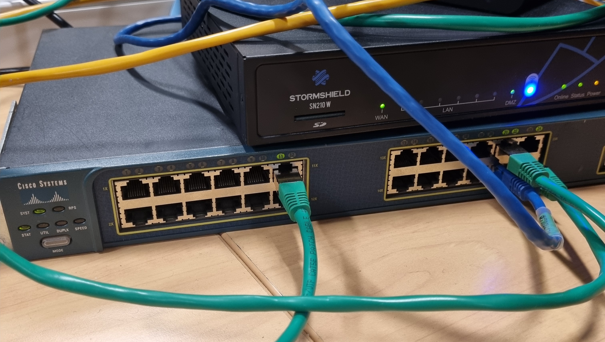

# Network and Services Deployment (Air & The)

Design and deployment of a secured IPv4 information system for a branch office of a fictional company, **Air & The**. The project builds the network (VLANs, DHCP per VLAN, OSPF routing, NAT, ACLs) on a Cisco switch and a Stormshield firewall, then installs and tests the core network services: DNS, DHCP, Web, Mail, LDAP, file sharing, and SSH.

Produced as an academic project and published under the alias **Zeto**.

> The company and domain (`airthestbarth.com`) are fictional. All addresses are private lab ranges.

## Executive summary

This project delivers and secures the core network services for a company branch office, from the ground up. It starts with VLAN segmentation and routing on a Cisco switch and a Stormshield firewall, then deploys DNS, DHCP, web, mail, LDAP, file sharing, and key-based SSH on Linux. Each service was installed, tested, and documented as a repeatable procedure. The outcome is a segmented, IPv4, security-conscious branch network with every service verified end to end.

## Requirements

Existing internal services to integrate: administration, production, and IT (SI). Network services to deploy: DNS, DHCP, Web, Mail, LDAP, file sharing, SSH (IT staff only, by key), WiFi access, and remote VPN. The whole system had to be secured and IPv4 only.

## Network architecture

Hardware: a Cisco switch and a Stormshield SN210W firewall.

### Switch port plan (24 ports)

| Ports | Assignment |
|-------|------------|
| 1-8 | Admin |
| 9-16 | Production |
| 17-20 | IT (SI) |
| 21-22 | Servers |
| 23 | Test port (security audit) |
| 24 | Trunk to the firewall |

### VLAN plan (gateways on .254)

| VLAN | Name | Network |
|------|------|---------|
| 10 | Admin | 192.168.10.0/24 |
| 30 | Production | 192.168.30.0/24 |
| 50 | IT (SI) | 192.168.50.0/24 |
| 100 | Servers | 192.168.100.0/24 |
| 101 | Tech | 192.168.101.0/24 |
| DMZ | DMZ | 172.16.16.0/24 (gateway .1) |

## Services

| Service | Software | Doc |
|---------|----------|-----|
| Network (VLAN, DHCP, OSPF, NAT, ACL) | Cisco IOS, Stormshield, BIRD | [docs/network.md](docs/network.md) |
| DNS | Bind9 | [docs/dns.md](docs/dns.md) |
| Web | Apache2 | [docs/web.md](docs/web.md) |
| Mail | Docker + Poste.io | [docs/mail.md](docs/mail.md) |
| LDAP directory | slapd + phpLDAPadmin | [docs/ldap.md](docs/ldap.md) |
| File sharing | Samba (LDAP integrated) | [docs/samba.md](docs/samba.md) |
| SSH | OpenSSH (key based) | [docs/ssh.md](docs/ssh.md) |

## Skills demonstrated

VLAN segmentation and trunking on Cisco IOS, DHCP per VLAN and OSPF dynamic routing on a Stormshield firewall, NAT and ACL filtering, and Linux service administration (Bind9, Apache2, Poste.io, OpenLDAP, Samba, OpenSSH) with functional testing of each service.
