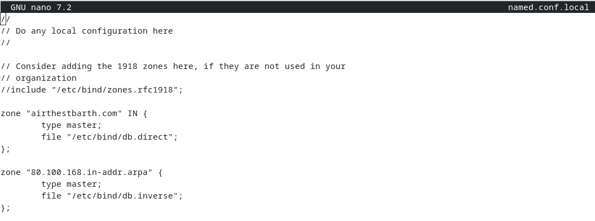
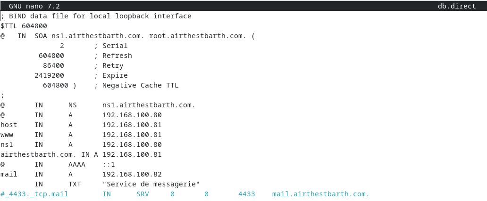
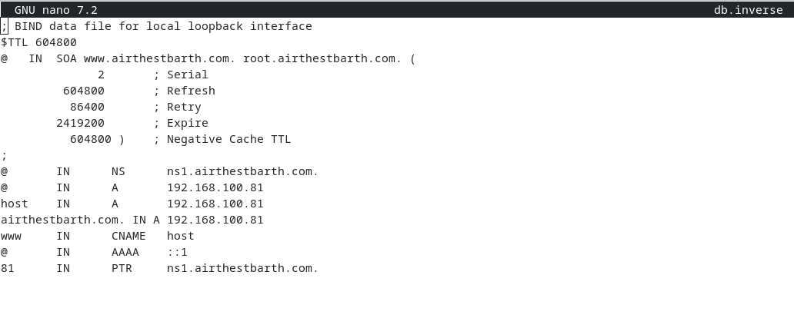
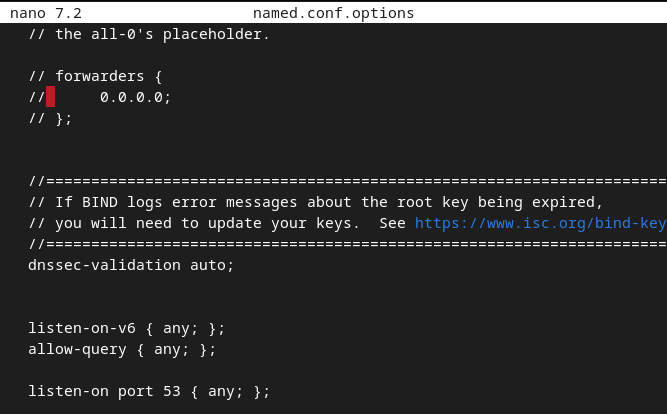
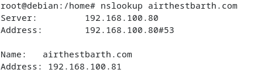
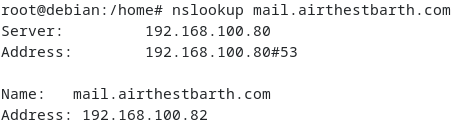
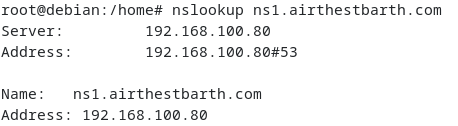

# DNS server (Bind9)

Bind9 is the open source DNS server used here.

## Install

```bash
apt install bind9
```

## Zones

Edit `/etc/bind/named.conf.local` and declare a forward zone for the domain and a reverse zone. The reverse zone uses the first three octets of the server address reversed. For a server at 192.168.100.80 the reverse zone is `100.168.192.in-addr.arpa`, which resolves an IP back to a name. Each zone points to a file (`db.direct` for forward, `db.inverse` for reverse) in the same directory.

## Forward file (db.direct)

Copy the `db.empty` template (`cp`), since zone files are very sensitive to syntax errors. Set the SOA line to the zone's DNS server name (`ns1.airthestbarth.com`) and the root (`root.airthestbarth.com`), and keep the default SOA options (Serial, Refresh, and so on). The Serial is the zone version number and must change on every edit.

Add the records: `NS` for the authoritative name server, `A` to map a name to an IP (for the web site `airthestbarth.com` and the mail server `mail.airthestbarth.com`), and `TXT` for text information tied to the domain.




## Reverse file (db.inverse)

Add a `PTR` record starting with the DNS server address, to map IPs back to names.



Restart the service:

```bash
systemctl restart bind9
```

## Forwarding

If the server resolves its own records but not unknown names, add a forwarder in `/etc/bind/named.conf.options` (the file syntax is very sensitive). This forwards unresolved names to a larger upstream DNS.



## Tests




