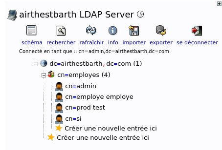
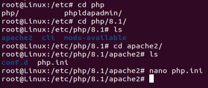
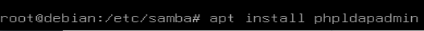

# LDAP directory (slapd + phpLDAPadmin)

## Install

```bash
apt install slapd phpldapadmin
```

## Configure slapd

Edit `/etc/ldap/ldap.conf` and set `BASE` and `URI` to your domain and server address. Then reconfigure slapd:

```bash
dpkg-reconfigure slapd
```

Through the prompts: do not skip the configuration, set the domain (here `airthestbarth.com`), set an administrator password (used to log in to phpLDAPadmin), and answer the remaining questions to create the directory.



## Configure phpLDAPadmin

Edit `/etc/phpldapadmin/config.php` and set the `setValue` lines with your directory name and the LDAP server IP (find it with `ip a`). The defaults are `dc=example,dc=com`, replace them with your domain components.

Reach the interface at `http://<server-ip>/phpldapadmin` and log in with the slapd admin password. From there you can import an existing LDIF file or create entries.

## Troubleshooting

If phpLDAPadmin reports a PHP memory limit error, edit `/etc/php/8.1/apache2/php.ini` and raise `memory_limit` from `128M` to `256M`.



This directory is later linked to the Samba file server, see [samba.md](samba.md).


