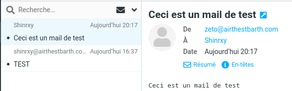
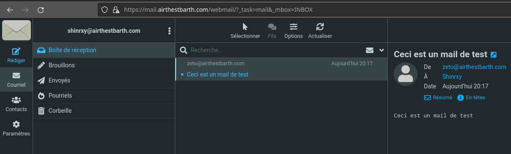

# Mail server (Docker + Poste.io)

## Install Docker

```bash
sudo apt-get install docker-ce docker-ce-cli containerd.io docker-buildx-plugin docker-compose-plugin
```

Create a directory for the mail data and configuration:

```bash
mkdir mail
```

## Run Poste.io

```bash
docker run --net=host -e TZ=Europe/Paris -v /home/mail:/data \
  --name "mailairthestbarth" -h "mail.airthestbarth.com" \
  -e "HTTP_PORT=80" -e "HTTPS_PORT=443" -t analogic/poste.io
```

Options: `-e` sets configuration parameters (for example `TZ`), `-v` sets the mail storage directory, `-h` sets the domain, and `HTTP_PORT` / `HTTPS_PORT` set the web ports. Since a whole VM was dedicated to the mail server with no other web service, ports 80 (HTTP) and 443 (HTTPS) were used.


The command prints the URL for configuring Poste.io. Open it in a browser, set the mail domain and the administrator email (`admin@airthestbarth.com`) with a password, then create accounts under `Email accounts`.




## Troubleshooting

If the admin URL does not appear, the mail port (25 or 587) is already in use by another process and must be stopped. If a web server runs on the same machine, change the HTTP and HTTPS ports in the docker command to avoid a conflict on 80 or 443.
