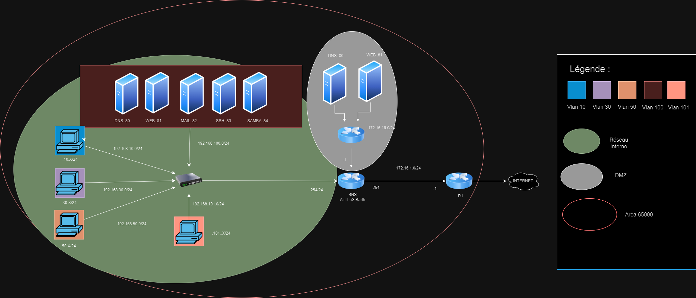
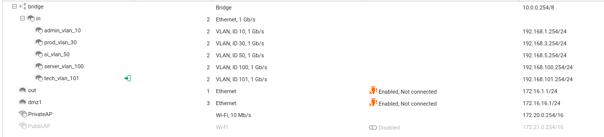
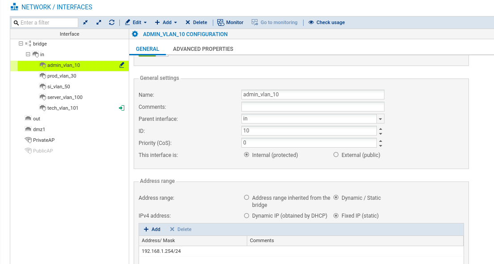
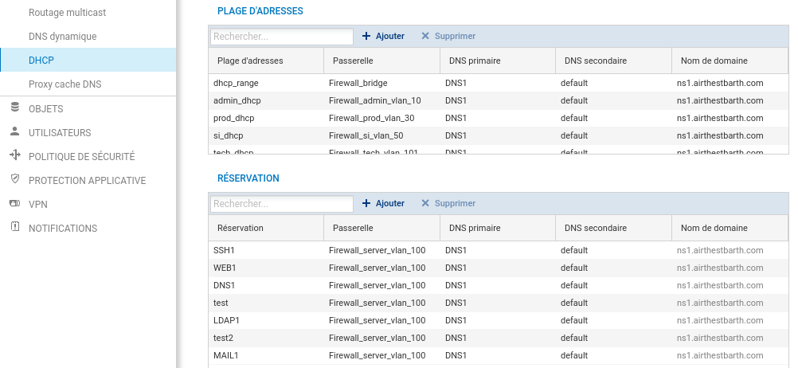
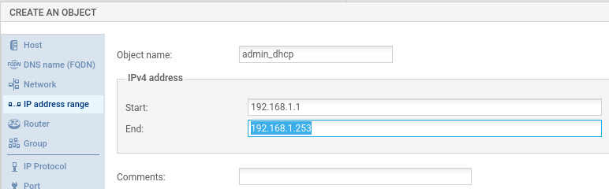
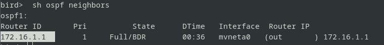
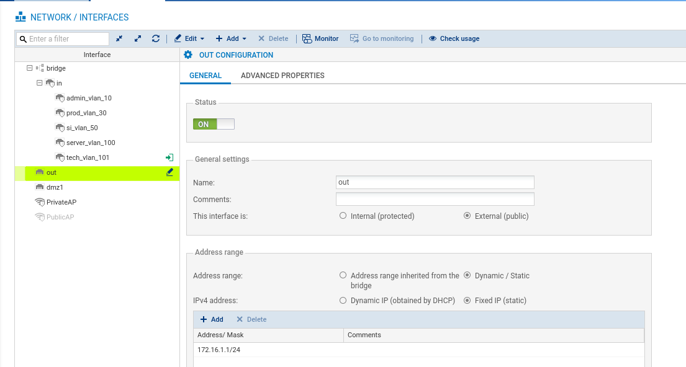
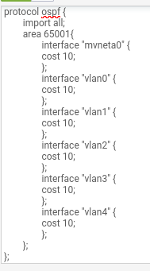
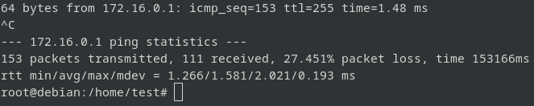
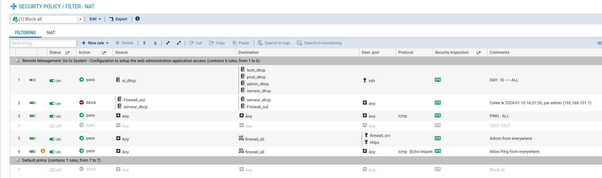

# Network: VLAN, DHCP, OSPF, NAT, ACL

The network is built on a Cisco switch (VLANs and trunk) and a Stormshield firewall (inter-VLAN gateway, DHCP per VLAN, OSPF routing, NAT, and filtering).



## VLANs on the switch

Connect to the switch console over serial (PuTTY) and configure the VLANs. Example for the Admin VLAN on FastEthernet 0/0 to 0/8:

```
enable
configure terminal
interface range FastEthernet 0/0 - 8
 switchport mode access
 switchport access vlan 10
```

Repeat for the other VLANs. Then set the uplink to the firewall as a trunk so every VLAN is carried on that link:

```
interface FastEthernet 0/24
 switchport mode trunk
```

## VLANs on the firewall

On the Stormshield, in `Network`, add a VLAN on the internal interface (`Add > VLAN`), for example `admin_vlan_10`, set its ID (10) and the gateway address (192.168.10.254/24). Repeat for the other VLANs. Configure the `out` interface (Internet egress) and a `dmz1` interface for the DMZ.




## DHCP per VLAN

In the `DHCP` tab, add an address range. The firewall works with objects, so create the range object if needed (for example `admin_dhcp` from 192.168.10.1 to 192.168.10.253), add the gateway object created with the VLAN, and the DNS object. In `Reservation` you can bind specific IPs to MAC addresses, which is useful so servers keep a fixed address.




## OSPF routing (BIRD)

The neighboring routers run OSPF, so the firewall runs it too. Connect to the firewall CLI (PuTTY or Minicom) and enter `birdc` to reach BIRD (the routing daemon). `show interfaces` lists the firewall interface names (`out` is `mvneta0`, `dmz` is `mvneta1`).




Then enable OSPF in `Routing > Dynamic Routing`, specifying OSPF area 65000 and the interfaces it covers (here `mvneta0` / `out`), so the router learns its neighbor's address over OSPF.




## NAT

NAT provides Internet access by translating the source address into the gateway address.

## ACL

Access control lists restrict inter-VLAN traffic to only what each service needs.


