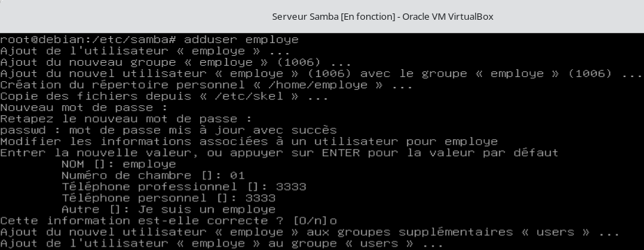
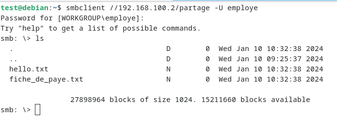
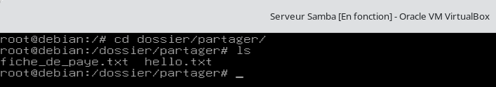
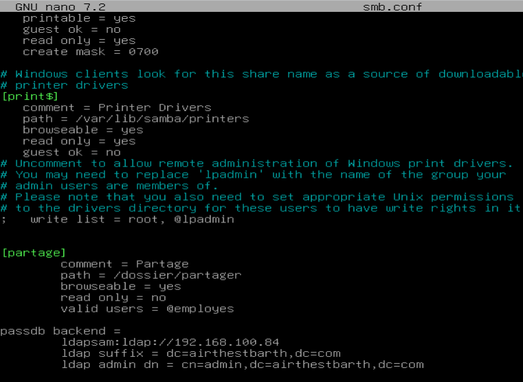

# File sharing (Samba)

## Install

```bash
apt update
apt install samba
```

## Configure the share

Edit `/etc/samba/smb.conf` and add a share section. `path` is the folder to share and `valid users` sets the allowed group:

```ini
[Partage]
   path = /srv/partage
   valid users = @employes
```

Restart the service after editing:

```bash
systemctl restart smbd
```

## Users and group

Create the group allowed to access the share, create the user, grant Samba access (with a Samba password), and add the user to the group:

```bash
groupadd employes
adduser employe
smbpasswd -a employe
gpasswd -a employe employes
```



## Connect

From a client, connect targeting the user:

```bash
smbclient //<server-ip>/Partage -U employe
```





## Link with LDAP

Samba can authenticate against the LDAP directory. Install `phpldapadmin`, then add the LDAP lines to `smb.conf` (LDAP server IP, LDAP suffix, and LDAP admin DN):



## Troubleshooting

A common issue is pointing `path` at the wrong directory. Check the slashes and restart the service after any change.
