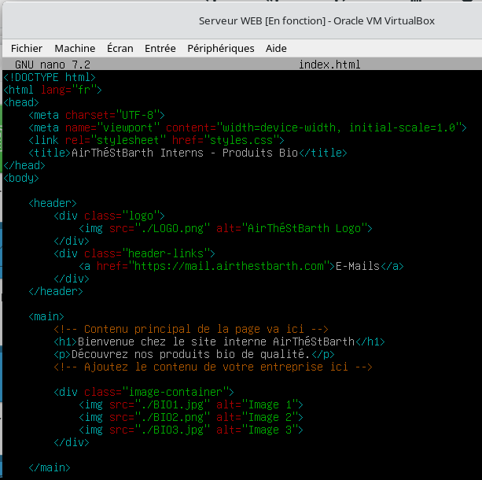
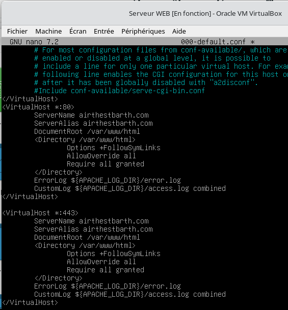
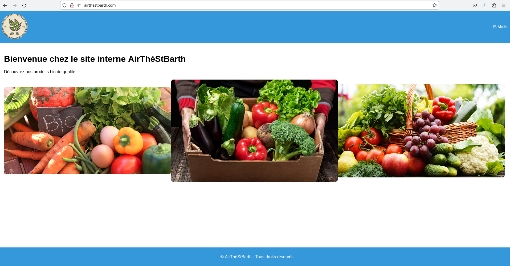

# Web server (Apache2)

## Install

```bash
apt update
apt install apache2
```

## Site content

Move to the web root and edit the index page:

```bash
cd /var/www/html
nano index.html
```

Put your site's HTML in `index.html`, or replace the default file with your own (named exactly `index.html`).



## Virtual host

Edit the site configuration:

```bash
cd /etc/apache2/sites-available
nano 000-default.conf
```

Set `ServerName` and `ServerAlias` to your site's names (here `airthestbarth.com`).



## Test


